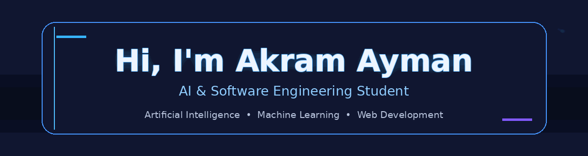

 

<h1>Hi, I'm Akram Ayman 👋</h1>

<h3>AI & Software Engineering Student</h3>

  <b>Artificial Intelligence</b> •
  <b>Machine Learning</b> •
  <b>Web Development</b> •
  <b>Cybersecurity</b>

  I'm a Computer Science student passionate about building practical solutions
  through programming, artificial intelligence, and software engineering.

---

## 👨‍💻 About Me

* 🎓 Studying **Computers, Information, and Artificial Intelligence**.
* 🤖 Interested in **Artificial Intelligence & Machine Learning**.
* 🌐 Learning and building projects with **Web Development**.
* 🔐 Exploring **Cybersecurity & Reconnaissance**.
* 💻 Working with **Python, C++, C#, SQL, and JavaScript**.
* 🧠 Interested in turning ideas into practical technical projects.

---

## 🛠️ Tech Stack

### Programming Languages

### AI & Machine Learning

### Web Development

### Cybersecurity

### Tools & Platforms

---

## 📚 Currently Learning

* Advanced Machine Learning concepts and model evaluation.
* Software Engineering and Web Development.
* Building practical AI-powered applications.
* Improving problem-solving and analytical thinking.

---

## 🚀 Featured Interests

|    🤖 AI & ML    |  🌐 Web Development  | 🔐 Cybersecurity |
| :--------------: | :------------------: | :--------------: |
|   Data Analysis  | Frontend Development |  Reconnaissance  |
| Machine Learning |     React & .NET     |  Bash Automation |
| Model Evaluation |      SQL & APIs      |       Linux      |

---

## 📊 GitHub Stats

 

---

## 💻 Code Cycle

     

     

 

<b>Debugging → Learning → Building → Improving</b>

---

  

<i>"Turning ideas into practical technical solutions."</i>

